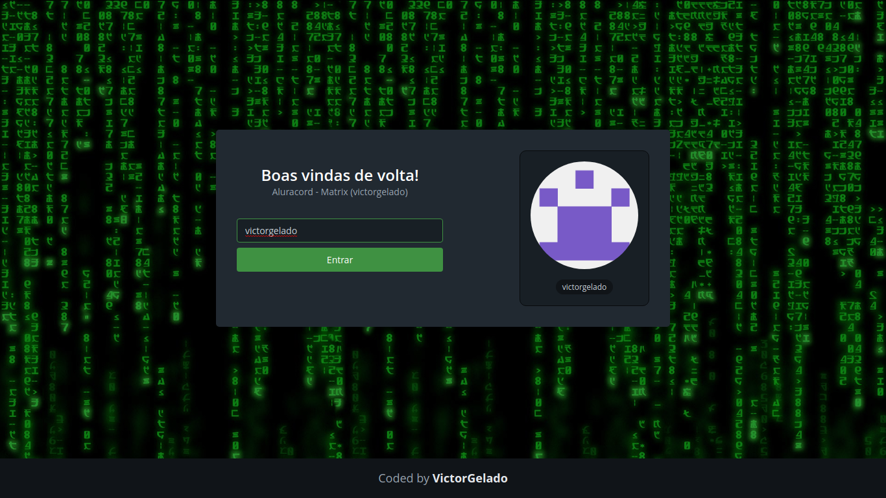

# Getting started with React js

This repository is my start with React js, my first React project.

## Table of contents

- [Overview](#overview)
  - [The challenge](#the-challenge)
  - [Screenshot](#screenshot)
  - [Links](#links)
- [My process](#my-process)
  - [Built with](#built-with)
  - [What I learned](#what-i-learned)
  - [Useful resources](#useful-resources)
- [Author](#author)
- [Acknowledgments](#acknowledgments)

## Overview

### The challenge

- The project aimed to create a real-time chat with React js, logging in with github.

### Screenshot

### Links

- Live Site URL: [Project](https://start-reactjs.vercel.app/)

## My process

### Built with

- [Supabase](https://supabase.com/) - Database
- [React](https://reactjs.org/) - JS library
- [Next.js](https://nextjs.org/) - React framework

### What I learned

I started with the basics, I still have a lot to learn. I learned:
- Use routes
- Make requests to the database
- Create components
- Use styles in javascript
- Login users
- Use 'useState'

And many more. All I learned was the basics, but I'm going to go further and further.

### Useful resources

- [Supabase](https://supabase.com/) - I really liked the subase, I will use it a lot.

## Author

Made by **VictorGelado**

  
  
  <a href="mailto:victorgeladocontato@gmail.com" target="_blank">

## Acknowledgments

I want to thank [alura](https://alura.com.br/), it helped a lot in my beginning with React js.
